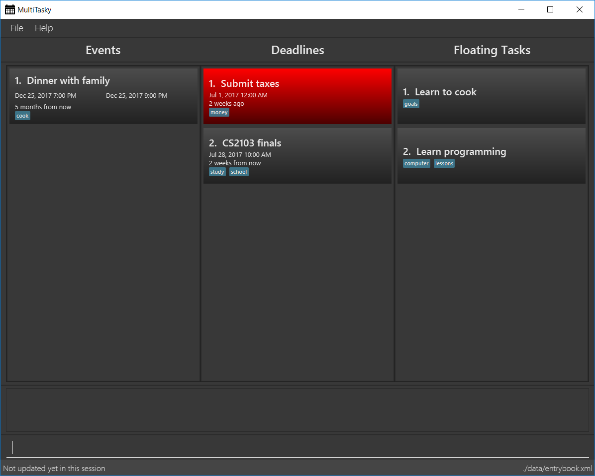

= MultiTasky
ifdef::env-github,env-browser[:relfileprefix: docs/]
ifdef::env-github,env-browser[:outfilesuffix: .adoc]

https://travis-ci.org/CS2103JUN2017-T2/main[image:https://travis-ci.org/CS2103JUN2017-T2/main.svg?branch=master[Build Status]]
https://ci.appveyor.com/project/mattheuslee/main[image:https://ci.appveyor.com/api/projects/status/cmwq6o0ssuwxmf42/branch/master?svg=true[Build status]]
https://coveralls.io/github/CS2103JUN2017-T2/main?branch=master[image:https://coveralls.io/repos/github/CS2103JUN2017-T2/main/badge.svg?branch=master[Coverage Status]]
https://www.codacy.com/app/mattheus.lee/main?utm_source=github.com&amp;utm_medium=referral&amp;utm_content=CS2103JUN2017-T2/main&amp;utm_campaign=Badge_Grade[image:https://api.codacy.com/project/badge/Grade/7660140ac8d643e18381426be58edf11[Codacy Badge]]

ifdef::env-github[]

endif::[]

ifndef::env-github[]
image::images/Ui.png[width="600"]
endif::[]

* This is a desktop task management application. It has a GUI but most of the user interactions happen using a CLI (Command Line Interface).
* The GUI incorporates three list panels for easy viewing of different types of tasks
** Events
** Deadlines
** Floating tasks (tasks with no start/end)
* Developer features include
** JUnit test cases, including automated GUI testing.
** Support for _Build Automation_ using Gradle and for _Continuous Integration_ using Travis CI.

== Site Map

* <<UserGuide#, User Guide>>
* <<DeveloperGuide#, Developer Guide>>
* <<LearningOutcomes#, Learning Outcomes>>
* <<AboutUs#, About Us>>
* <<ContactUs#, Contact Us>>

== Acknowledgements

* Original application code by https://github.com/se-edu[SE-EDU]

* Some parts of this sample application were inspired by the excellent http://code.makery.ch/library/javafx-8-tutorial/[Java FX tutorial] by
_Marco Jakob_.

== Licence : link:LICENSE[MIT]
